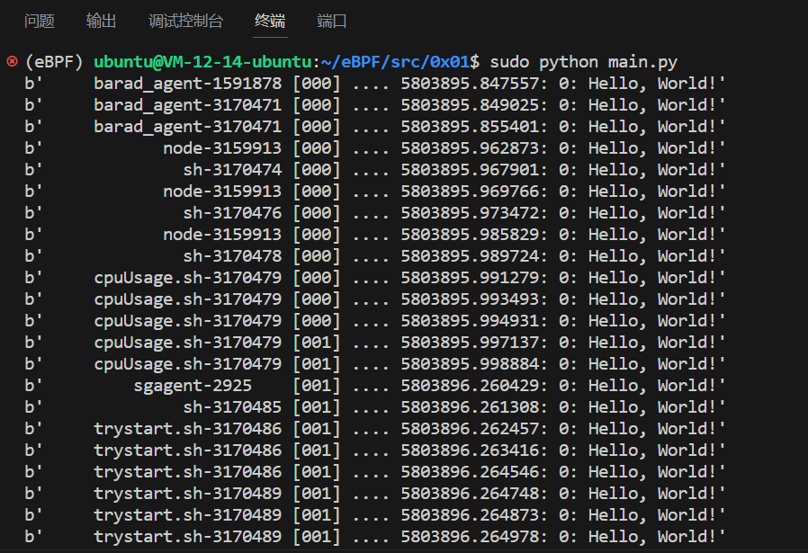

# 0x01 Hello World

## Code

```Python
from bcc import BPF

BPF(text='int kprobe__sys_clone(void *ctx) { bpf_trace_printk("Hello, World!\\n"); return 0; }').trace_print()
```

## Explain

- `text='...'` 这里定义了一个内联的、C 语言写的 BPF 程序。

- `kprobe__sys_clone()` 这是一个通过内核探针(kprobe)进行内核动态跟踪的快捷方式。BCC 规定如果一个 C 函数名开头为 `kprobe__` ，则后面的部分实际为设备的内核函数名，这里是 `sys_clone()`。这个是 Linux 创建进程的系统调用函数，对应的系统调用号为 56。

- `void *ctx` 这里的 ctx 实际上有一些参数，不过此处用不到，暂时转为 `void *`。

- `bpf_trace_printk()` 这是一个 bpf 机制提供的简单内核设施，用于 `printf()` 到 `trace_pipe`，可以理解为 BPF C 代码中的 `printf()`。它一般来快速调试一些东西，不过有一些限制：最多有三个参数，一个%s ，并且 trace_pipe 是全局共享的，所以会导致并发程序的输出冲突，因而 BPF_PERF_OUTPUT() 是一个更棒的方案，我们后面会提到。

- `return 0` 这是一个必须的部分，若不执行会产生[问题](https://github.com/iovisor/bcc/issues/139)。

- `.trace_print()` 通过这个函数来读取 `trace_pipe` 里的内容。

注意一定要开 `sudo` 运行这个程序，否则会报错找不到 `bcc` 模块，得到以下类似输出

```
b'            node-2989456 [001] .... 5791352.693831: 0: Hello, World!'
b'              sh-3070476 [001] .... 5791352.699851: 0: Hello, World!'
b'            node-2989456 [000] .... 5791352.701426: 0: Hello, World!'
b'              sh-3070478 [001] .... 5791352.706928: 0: Hello, World!'
b'            node-2989456 [001] .... 5791352.718441: 0: Hello, World!'
b'              sh-3070480 [001] .... 5791352.723296: 0: Hello, World!'
b'     cpuUsage.sh-3070481 [001] .... 5791352.725241: 0: Hello, World!'
b'     cpuUsage.sh-3070481 [001] .... 5791352.727851: 0: Hello, World!'
b'     cpuUsage.sh-3070481 [000] .... 5791352.729912: 0: Hello, World!'
b'     cpuUsage.sh-3070481 [000] .... 5791352.731189: 0: Hello, World!'
b'     cpuUsage.sh-3070481 [000] .... 5791352.732478: 0: Hello, World!'
b'     barad_agent-1591878 [000] .... 5791352.865449: 0: Hello, World!'
```

如果新建一个窗口运行 `ls` 指令会得到下列类似输出。

```
b'        lesspipe-3063250 [000] .... 5790483.310366: 0: Hello, World!'
```

