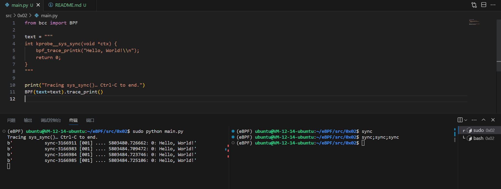

# 0x02 sys_sync()

尝试练习一下探测 `sys_sync` 吧，检测到 `sync` 时打印出 `"sys_sync() called"`。0x01 有一切你需要用的知识。你可以通过在另外的会话里运行 `sync` 来测试。

你还可以在程序开始时打印 `"Tracing sys_sync()… Ctrl-C to end."`，不过这只是只靠 Python 实现的而已。

译者注：`sync` 为 `UNIX` 操作系统的标准系统调用，功能为将内核文件系统缓冲区的所有数据写入存储介质。

## Code

```Python
from bcc import BPF

text = """
int kprobe__sys_sync(void *ctx) {
    bpf_trace_printk("Hello, World!\\n");
    return 0;
}
"""

print()
BPF(text=text).trace_print()
```

## Explain

0x02 的实现大致与 0x01 类型，为了探测 `sys_sync` 我们将 0x01 中的函数 `kprobe__sys_clone` 修改为了 `kprobe__sys_sync`。

同时在 Python 程序中输出 `"Tracing sys_sync()… Ctrl-C to end."`。

为了让 NCC 程序能够探测到 `sys_sync`，我们需要新开一个窗口手动运行 `sync` 指令。

