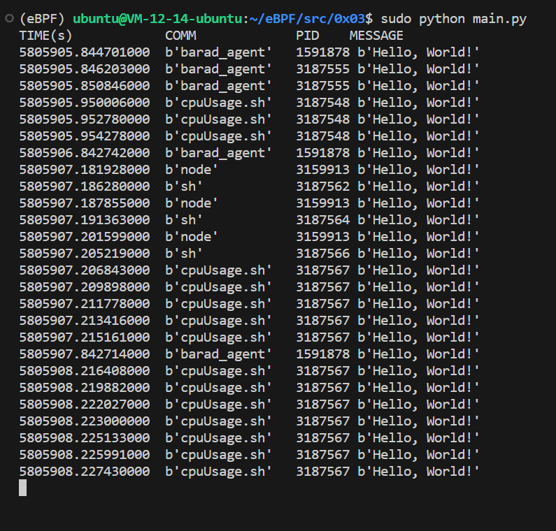

# 0x03 hello_fields.py

## Code

```C
int hello(void *ctx) {
    bpf_trace_printk("Hello, World!\n");
    return 0;
}
```

```Python
from bcc import BPF

# load BPF program
b = BPF(src_file="bpf.c")
b.attach_kprobe(event=b.get_syscall_fnname("clone"), fn_name="hello")

# header
print("%-18s %-16s %-6s %s" % ("TIME(s)", "COMM", "PID", "MESSAGE"))

# format output
while 1:
    try:
        (task, pid, cpu, flags, ts, msg) = b.trace_fields()
    except ValueError:
        continue
    print("%-18.9f %-16s %-6d %s" % (ts, task, pid, msg))
```

## Explain

0x03 的逻辑和 0x01 很接近，也是通过探测 `sys_clone()` 跟踪了一些新进程的创建，但是有一些新东西：

- `src_file="bpf.c"` 这次我们在外部创建了一个 C 程序源码，之后在 Python 程序中引用它，提供了分包实现。

- `hello()` 现在我们声明了一个任意的 C 语言函数，而不是使用 `kprobe__` 开头的快捷方式。BPF 程序中的任何 C 函数都需要在一个**探针**上执行，因而我们必须将 `pt_reg* ctx` 这样的 `ctx` 变量放在第一个参数。如果你需要声明一些不在探针上执行的辅助函数，则需要定义成 static inline 以便编译器内联编译。

- `b.get_syscall_fnname("clone")` 考虑到不同的 Linux 内核对于同一个系统调用名可能有不同的实现方法，`get_syscall_fnname()` 函数可以根据运行平台自动获取内核函数名。

- `b.attach_kprobe(event=b.get_syscall_fnname("clone"), fn_name="hello")` 这里建立了一个内核探针，以便内核系统出现 `clone` 操作时执行 `hello()` 这个函数。在同一个 BCC 程序中可以多次调用 `attch_kprobe()`，这样就可以跟踪多个内核函数。

- `b.trace_fields()` 这里从 `trace_pipe` 返回一个混合数据，方便在 Python 程序中对数据做额外分析。

