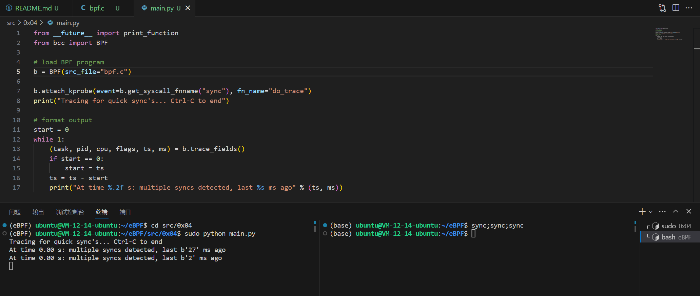

# sync_timing.py

下面的这个 BCC 例子会将连续执行时间小于 1s 的 `sync` 探测出来。也就是说如果使用了命令 `sync;sync;sync`，后面两次 `sync` 会被打印出来。

## Code

```C
#include <uapi/linux/ptrace.h>

BPF_HASH(last);

int do_trace(struct pt_regs *ctx) {
    u64 ts, *tsp, delta, key = 0;

    // attempt to read stored timestamp
    tsp = last.lookup(&key);
    if (tsp != 0) {
        delta = bpf_ktime_get_ns() - *tsp;
        if (delta < 1000000000) {
            // output if time is less than 1 second
            bpf_trace_printk("%d\n", delta / 1000000);
        }
        last.delete(&key);
    }

    // update stored timestamp
    ts = bpf_ktime_get_ns();
    last.update(&key, &ts);
    return 0;
}
```

```Python
from __future__ import print_function
from bcc import BPF

# load BPF program
b = BPF(src_file="bpf.c")

b.attach_kprobe(event=b.get_syscall_fnname("sync"), fn_name="do_trace")
print("Tracing for quick sync's... Ctrl-C to end")

# format output
start = 0
while 1:
    (task, pid, cpu, flags, ts, ms) = b.trace_fields()
    if start == 0:
        start = ts
    ts = ts - start
    print("At time %.2f s: multiple syncs detected, last %s ms ago" % (ts, ms))
```

## Explain

这段代码会探测每次 `sync` 操作并记录对应的时间。每次探测时计算与上一次 `sync` 的时间间隔，如果间隔小于 1s 便输出探测结果，并更新上一次 `sync` 的时刻。

- `bpf_ktime_get_ns()` 以纳秒为单位返回当前时间。

- `BPF_HASH(last)` 创建一个名为 `last` 的 `BPF hash` 映射。这里使用了默认参数，所以使用了默认的 `u64` 作为 `key` 和 `value` 的类型，这里可以理解为一个储存数据用的全局变量。

- `key = 0` 这个程序只储存一个键值对，所以 `key` 固定为 0 即可。

- `last.lookup(&key)` 在全局的字典中寻找一个 `key` 对应的 `value`。不存在会返回 0，需要传入 `key` 的地址。

- `last.delete(&key)` 顾名思义，移除一个键值对。至于为什么要删除，参见这个内核 [bug](https://git.kernel.org/cgit/linux/kernel/git/davem/net.git/commit/?id=a6ed3ea65d9868fdf9eff84e6fe4f666b8d14b02)。

- `last.update(&key, &ts)` 顾名思义，传入两个参数，覆盖更新原有的键值对。

这个是 BCC 的官方用例，我感觉多少有点复杂，判断时间间隔的部分如果放在 Python 部分来处理会很方便，不过 0x04 主要是为了演示 `BPF_HASH` 的用法那就无所谓了。

