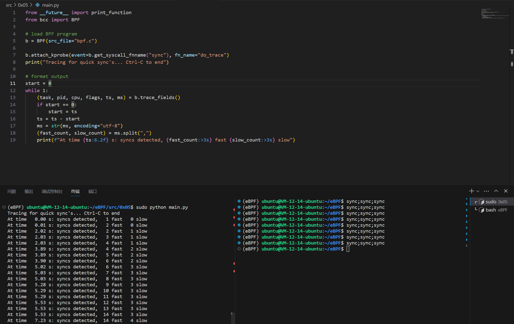

# sync_count.py

修改 0x04 的 `sync_timing.py` 程序，以存储所有内核中调用 `sync` 的计数(快速和慢速)，并打印出来。

通过向现有的 `hash` 映射添加新的键值对，可以在 `BPF` 程序中记录此计数。

## Code

```C
#include <uapi/linux/ptrace.h>

BPF_HASH(last);

int do_trace(struct pt_regs *ctx) {
    u64 ts, *tsp, delta, key = 0;
    u64 k1 = 1, k2 = 2;
    u64 *n1, *n2, v1 = 0, v2 = 0;

    // attempt to read stored timestamp
    tsp = last.lookup(&key);
    n1 = last.lookup(&k1);
    n2 = last.lookup(&k2);
    if (tsp != 0 && n1 != 0 && n2 != 0) {
        delta = bpf_ktime_get_ns() - *tsp;
        v1 = (*n1);
        v2 = (*n2);
        if (delta < 1000000000) {
            v1 ++;
        } else {
            v2 ++;
        }
        bpf_trace_printk("%d,%d\n", v1, v2);
        last.delete(&key);
    }

    // update stored timestamp
    ts = bpf_ktime_get_ns();
    last.update(&key, &ts);
    last.update(&k1, &v1);
    last.update(&k2, &v2);
    return 0;
}
```

```Python
from __future__ import print_function
from bcc import BPF

# load BPF program
b = BPF(src_file="bpf.c")

b.attach_kprobe(event=b.get_syscall_fnname("sync"), fn_name="do_trace")
print("Tracing for quick sync's... Ctrl-C to end")

# format output
start = 0
while 1:
    (task, pid, cpu, flags, ts, ms) = b.trace_fields()
    if start == 0:
        start = ts
    ts = ts - start
    ms = str(ms, encoding="utf-8")
    (fast_count, slow_count) = ms.split(",")
    print(f"At time {ts:6.2f} s: syncs detected, {fast_count:>3s} fast {slow_count:>3s} slow")
```

## Explain

0x05 的代码实现与 0x04 类似，我在 `bpf.c` 程序中多维护了两个全局变量 `n1` 和 `n2`，分别记录 `sync` 的快速和慢速调用的次数。

现在 BPF 程序依旧会做时间间隔的判断，不过与 0x04 不同的是，现在只要探测到了 `sync` 都会做输出。

依据时间间隔来修改全局变量 `n1` 和 `n2` 的值，因为 BPF 程序里没有全局变量的概念，所以引入了 `v1` 和 `v2` 来辅助维护计数。

BPF 程序将维护的计数值通过 `bpf_trace_printk("%d,%d\n", v1, v2);` 提交给 Python 程序，Python 程序首先对得到的内容解码从 `bytes` 类型转换为 `str` 类型，然后使用 `.split(",")` 拆分出 `v1` 和 `v2` 的数值，并输出到控制台。

体验下来就是在 BPF 里面维护全局变量是麻烦的，我觉得 BPF 应该只做探测的任务，数据分析交给 Python 的话会很方便。

