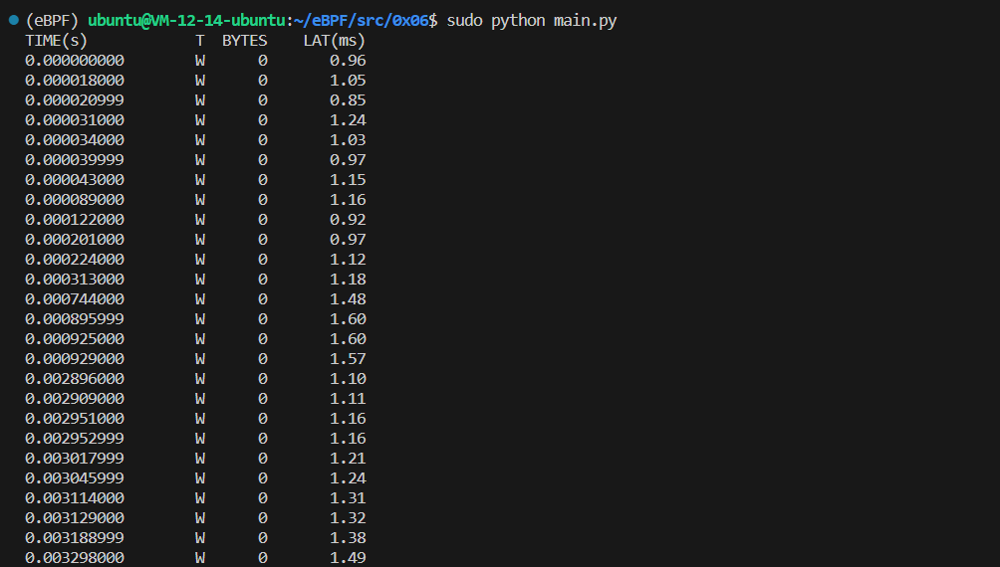

# disksnoop.py

## Code

```C
#include <uapi/linux/ptrace.h>
#include <linux/blk-mq.h>

BPF_HASH(start, struct request *, u64);

void trace_start(struct pt_regs *ctx, struct request *req) {
	u64 ts = bpf_ktime_get_ns();
	start.update(&req, &ts);
}

void trace_completion(struct pt_regs *ctx, struct request *req) {
	u64 *tsp, delta;

	tsp = start.lookup(&req);
	if (tsp != 0) {
		delta = bpf_ktime_get_ns() - *tsp;
		bpf_trace_printk("%d %x %d\n", req->__data_len, req->cmd_flags, delta / 1000);
		start.delete(&req);
	}
}
```

```Python
from __future__ import print_function
from bcc import BPF

REQ_WRITE = 1

# load BPF program
b = BPF(src_file="bpf.c")

if BPF.get_kprobe_functions(b'blk_start_request'):
    b.attach_kprobe(event="blk_start_request", fn_name="trace_start")
b.attach_kprobe(event="blk_mq_start_request", fn_name="trace_start")

if BPF.get_kprobe_functions(b'__blk_account_io_done'):
    b.attach_kprobe(event="__blk_account_io_done", fn_name="trace_completion")
else:
    b.attach_kprobe(event="blk_account_io_done", fn_name="trace_completion")

# header
print("%-18s %-2s %-7s %8s" % ("TIME(s)", "T", "BYTES", "LAT(ms)"))
start = 0

# format output
while 1:
    try:
        (task, pid, cpu, flags, ts, msg) = b.trace_fields()
        (bytes_s, bflags_s, us_s) = str(msg, encoding="utf-8").split()

        if start == 0:
            start = ts

        if int(bflags_s, 16) & REQ_WRITE:
            type_s = "W"
        elif bytes_s == "0":
            type_s = "M"
        else:
            type_s = "R"
        ms = float(int(us_s, 10)) / 1000

        print(f"{ts - start:<18.9f} {type_s:2s} {bytes_s:>5s} {ms:10.2f}")
    except KeyboardInterrupt:
        exit()
```

## Explain

- `trace_start(struct pt_regs *ctx, struct request *req)` 这个函数会被附加到内核探针上。`struct pt_regs *ctx` 是内核探针的默认参数，用于寄存和 BPF 上下文；`struct request *` 是被探测的函数 `blk_start_request()` 的实际参数，当被探测的函数需要传参时，需要在此处补上。

- `start.update(&req, &ts)` 将请求结构体的指针作为 `hash` 映射中的 `key`。指向结构体的指针是很好的 `key`，因为这是唯一的。

- `req->__data_len` 此处解引用 `struct request` 的成员，我们可以在 `Linux` 的内核源代码中看到 `request` 的成员定义。指针操作在 BPF 安全检测中是危险的，BCC 实际上将这些表达式重写为一系列的 `bpf_probe_read()` 调用。有时候 BCC 可能无法处理十分复杂的解引用，这时候就需要直接调用 `bpf_probe_read()`。

整个程序其实是在监测 IO 请求，当一个 IO 请求发生时，记录开始信息；当 IO 请求结束时再捕获结束信息。

下方是一个典型的输出：

```
TIME(s)            T  BYTES    LAT(ms)
16458043.436012    W  4096        3.13
16458043.437326    W  4096        4.44
16458044.126545    R  4096       42.82
16458044.129872    R  4096        3.24
[...]
```

