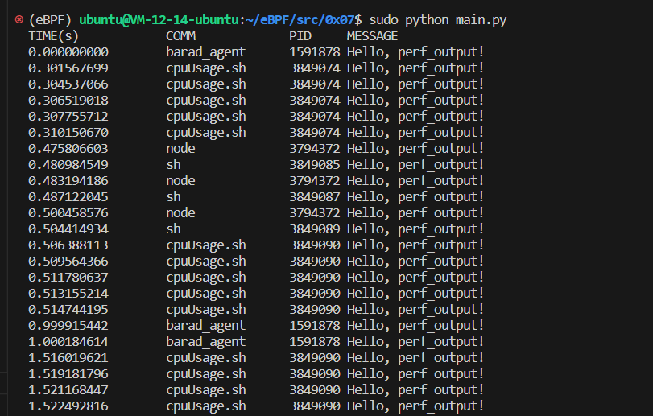

# hello_perf_output.py

此处不再使用线程不安全的 `bpf_trace_printk()` 而使用更推荐的 `BPF_PERF_OUTPUT()` 接口。这也意味着我们不再继续简单地通过 `trace_field()` 来方便的获取 `PID` 和时间戳，我们需要调用一些函数直接获取他们。

## Code

```C
#include <linux/sched.h>

// define output event structure in C
struct event_t {
    u32 pid;
    u64 ts;
    char comm[TASK_COMM_LEN];
};
BPF_PERF_OUTPUT(result);

int hello(struct pt_regs *ctx) {
    struct event_t event = {};

    event.pid = bpf_get_current_pid_tgid();
    event.ts = bpf_ktime_get_ns();
    bpf_get_current_comm(&event.comm, sizeof(event.comm));

    result.perf_submit(ctx, &event, sizeof(event));

    return 0;
}
```

```Python
from bcc import BPF

b = BPF(src_file="bpf.c")
b.attach_kprobe(event=b.get_syscall_fnname("clone"), fn_name="hello")

print("%-18s %-16s %-6s %8s" % ("TIME(s)", "COMM", "PID", "MESSAGE"))

# process event
start = 0
def print_event(cpu, data, size):
    global start
    event = b["result"].event(data)
    if start == 0:
            start = event.ts
    time_s = (float(event.ts - start)) / 1000000000
    print("%-18.9f %-16s %-6d %s" % (time_s, str(event.comm, encoding="utf-8"), event.pid, "Hello, perf_output!"))

# loop with callback to print_event
b["result"].open_perf_buffer(print_event)
while 1:
    b.perf_buffer_poll()
```

## Explain

- `struct data_t` 一个简单的 C 语言结构体，用于从内核态向用户态传输数据。

- `BPF_PERF_OUTPUT(result)` 将内核传出的数据打印到 `"result"` 这个通道内，实际上这就是 bpf 对象的一个 key，可以通过 bpf_object["result"] 的方式读取。

- `bpf_get_current_pid_tgid()` 返回一个 u64，位于低 32 位的进程 ID (内核态中的 PID，用户态中实际为线程 ID)，位于高 32 位的线程组 ID (用户态中实际为 PID)。此处取低 32 位。

- `bpf_get_current_comm(&data.comm, sizeof(data.comm));` 将当前进程名。

- `reault.perf_submit()` 通过 perf 缓冲区环将结果提交到用户态。

- `def print_event()` 定义一个函数从 `result` 流中读取 `event`。这里的 `cpu, data, size` 是默认的传入内容，连接到流上的函数必须要有这些参数。

- `b["events"].event(data)` 在 Python 中从 `result` 中获取 `event`。

- `b["events"].open_perf_buffer(print_event)` 将 `print_event()` 函数连接在 `result` 通道上。

这段代码使用 `BPF_PERF_OUTPUT()` 接口，这让内核态与用户态的数据交流更加可控。我们不仅可以划分多个数据通道来区分数据，还可以将数据打包成一个结构体来封装我们的数据。

