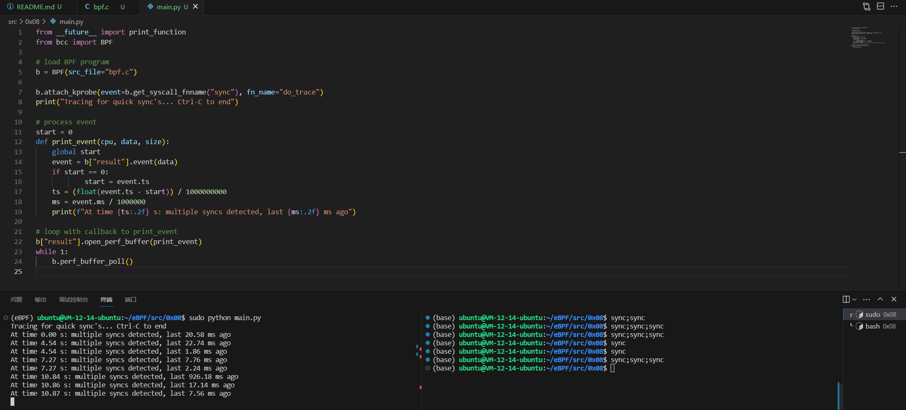

# sync_perf_output.py

使用 `BPF_PERF_OUTPUT` 重新编写 0x04。

## Code

```C
#include <uapi/linux/ptrace.h>

struct event_t {
    u64 ts;
    u64 ms;
};
BPF_PERF_OUTPUT(result);
BPF_HASH(last);

int do_trace(struct pt_regs *ctx) {
    u64 ts, *tsp, key = 0;

    // attempt to read stored timestamp
    tsp = last.lookup(&key);
    if (tsp != 0) {
        struct event_t event = {};
        event.ts = bpf_ktime_get_ns();
        event.ms = event.ts - *tsp;
        if (event.ms < 1000000000) {
            // output if time is less than 1 second
            result.perf_submit(ctx, &event, sizeof(event));
        }
        last.delete(&key);
    }

    // update stored timestamp
    ts = bpf_ktime_get_ns();
    last.update(&key, &ts);
    return 0;
}
```

```Python
from __future__ import print_function
from bcc import BPF

# load BPF program
b = BPF(src_file="bpf.c")

b.attach_kprobe(event=b.get_syscall_fnname("sync"), fn_name="do_trace")
print("Tracing for quick sync's... Ctrl-C to end")

# process event
start = 0
def print_event(cpu, data, size):
    global start
    event = b["result"].event(data)
    if start == 0:
            start = event.ts
    ts = (float(event.ts - start)) / 1000000000
    ms = event.ms / 1000000
    print(f"At time {ts:.2f} s: multiple syncs detected, last {ms:.2f} ms ago")

# loop with callback to print_event
b["result"].open_perf_buffer(print_event)
while 1:
    b.perf_buffer_poll()
```

## Explain

此处我们结合 0x04 和 0x07 的代码，使用 `BPF_PERF_OUTPUT` 重新编写 0x04。

