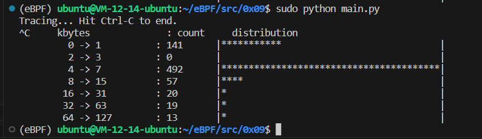

# sync_perf_output.py

## Code

```C
#include <uapi/linux/ptrace.h>
#include <linux/blkdev.h>

BPF_HISTOGRAM(dist);

int kprobe__blk_account_io_completion(struct pt_regs *ctx, struct request *req) {
	dist.increment(bpf_log2l(req->__data_len / 1024));
	return 0;
}
```

```Python
from bcc import BPF

# load BPF program
b = BPF(src_file="bpf.c")

# header
print("Tracing... Hit Ctrl-C to end.")

# trace until Ctrl-C
try:
    while(True):
        pass
except KeyboardInterrupt:
	pass

# output
b["dist"].print_log2_hist("kbytes")
```

## Explain

- `BPF_HISTOGRAM(hist)` 定义一个直方图形式的 `BPF` 映射，名为 `hist`。

- `dist.increment()` 第一个参数的运算结果作为直方图索引的递增量，默认为 1。自定义的递增量可以作为第二个参数提供。

- `bpf_log2l()` 返回参数以 2 为底的对数值。 这将作为我们直方图的索引，因此我们正在构建 2 的幂直方图。

- `b["dist"].print_log2_hist("kbytes")` 将直方图 `dist` 的索引打印为 2 的幂，列标题为 `"kbytes"`。

总的来说这是一个 BPF 内置的直方图展示工具。

