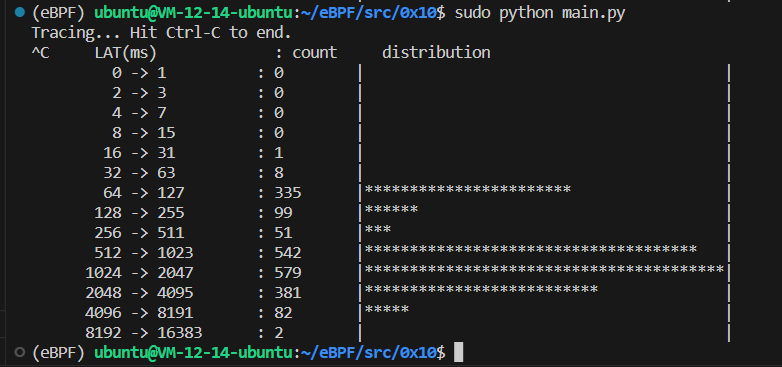

# disklatency.py

编写一个对磁盘 I/O 进行计时的程序，并打印出延迟的直方图。磁盘 I/O 工具和时序可以在 0X06 中找到，直方图代码可以在 0X09 中找到。

## Code

```C
#include <uapi/linux/ptrace.h>
#include <linux/blkdev.h>
#include <linux/blk-mq.h>

BPF_HASH(start, struct request *, u64);
BPF_HISTOGRAM(dist);

void trace_start(struct pt_regs *ctx, struct request *req) {
	u64 ts = bpf_ktime_get_ns();
	start.update(&req, &ts);
}

void trace_completion(struct pt_regs *ctx, struct request *req) {
	u64 *tsp, delta;

	tsp = start.lookup(&req);
	if (tsp != 0) {
		delta = bpf_ktime_get_ns() - *tsp;
		dist.increment(bpf_log2l(delta / 1000));
		start.delete(&req);
	}
}
```

```Python
from bcc import BPF

# load BPF program
b = BPF(src_file="bpf.c")

if BPF.get_kprobe_functions(b'blk_start_request'):
    b.attach_kprobe(event="blk_start_request", fn_name="trace_start")
b.attach_kprobe(event="blk_mq_start_request", fn_name="trace_start")

if BPF.get_kprobe_functions(b'__blk_account_io_done'):
    b.attach_kprobe(event="__blk_account_io_done", fn_name="trace_completion")
else:
    b.attach_kprobe(event="blk_account_io_done", fn_name="trace_completion")

# header
print("Tracing... Hit Ctrl-C to end.")

# trace until Ctrl-C
try:
    while(True):
        pass
except KeyboardInterrupt:
	pass

# output
b["dist"].print_log2_hist("LAT(ms)")
```

## Explain

参照 0x06 和 0x09 的代码，将 0x06 用于输出的部分删掉，每次计算得到 IO 请求的用时后调用 `dist.increment(bpf_log2l(delta / 1000));`，最后 Python 程序部分参照 0x09 的实现即可。

