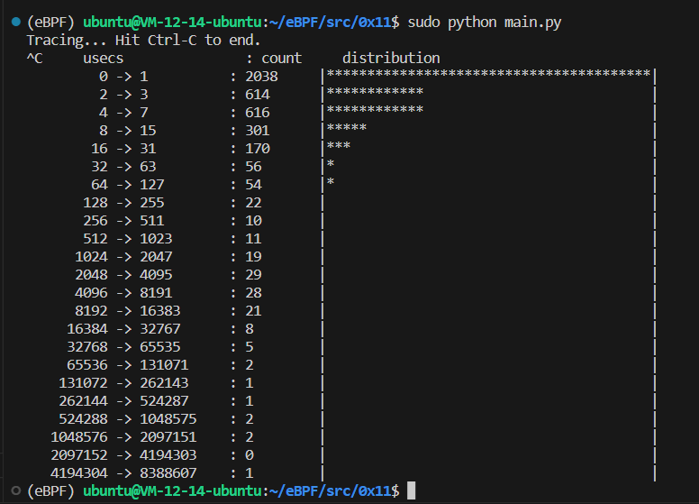

# vfsreadlat.py

## Code

```C
#include <uapi/linux/ptrace.h>

BPF_HASH(start, u32);
BPF_HISTOGRAM(dist);

int do_entry(struct pt_regs *ctx) {
	u32 pid;
	u64 ts;

	pid = bpf_get_current_pid_tgid();
	ts = bpf_ktime_get_ns();
	start.update(&pid, &ts);
	return 0;
}

int do_return(struct pt_regs *ctx) {
	u32 pid;
	u64 *tsp, delta;

	pid = bpf_get_current_pid_tgid();
	tsp = start.lookup(&pid);

	if (tsp != 0) {
		delta = bpf_ktime_get_ns() - *tsp;
		dist.increment(bpf_log2l(delta / 1000));
		start.delete(&pid);
	}

	return 0;
}
```

```Python
from bcc import BPF

# load BPF program
b = BPF(src_file = "bpf.c")
b.attach_kprobe(event="vfs_read", fn_name="do_entry")
b.attach_kretprobe(event="vfs_read", fn_name="do_return")

# header
print("Tracing... Hit Ctrl-C to end.")

# output
try:
    while(True):
        pass
except KeyboardInterrupt:
    pass

b["dist"].print_log2_hist("usecs")
b["dist"].clear()
```

## Explain

- `b.attach_kretprobe(event="vfs_read", fn_name="do_return")` 将 `do_return()` 附加到内核函数 `vfs_read()` 的出口上。这里探测的对象是内核函数的返回值或输出值，而非它的输入值。

- `["dist"].clear()` 清理直方图。

这部分的代码主要演示了如何探测内核函数的出口。

