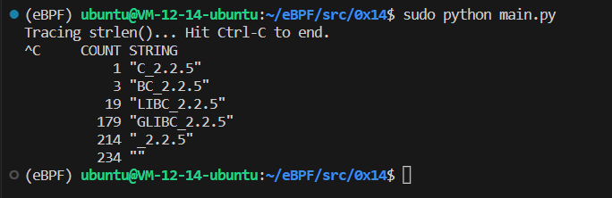

# strlen_count.py

## Code

```C
#include <uapi/linux/ptrace.h>

struct key_t {
    char c[80];
};
BPF_HASH(counts, struct key_t);

int count(struct pt_regs *ctx) {
    if (!PT_REGS_PARM1(ctx))
        return 0;

    struct key_t key = {};
    u64 zero = 0, *val;

    bpf_probe_read(&key.c, sizeof(key.c), (void *)PT_REGS_PARM1(ctx));
    // could also use `counts.increment(key)`
    val = counts.lookup_or_init(&key, &zero);
    (*val)++;
    return 0;
};
```

```Python
from bcc import BPF

# load BPF program
b = BPF(src_file="bpf.c")
b.attach_uprobe(name="c", sym="strlen", fn_name="count")

# header
print("Tracing strlen()... Hit Ctrl-C to end.")

# sleep until Ctrl-C
try:
    while(True):
        pass
except KeyboardInterrupt:
    pass

# print output
print("%10s %s" % ("COUNT", "STRING"))
counts = b.get_table("counts")
for k, v in sorted(counts.items(), key=lambda counts: counts[1].value):
    print("%12d \"%s\"" % (v.value, str(k.c, encoding="utf-8")))
```

## Explain

- `PT_REGS_PARM1(ctx)` 这是取回所探测的目标函数 `strlen()` 的第一个参数，也就是处理的目标字符串。

- `b.attach_uprobe(name="c", sym="strlen", fn_name="count")` 将探针附加到 `C library`(如果这是主函数，需要使用绝对路径)，探测的目标函数是 `strlen()`，探测到执行时调用 BPF 程序中的 `count()`。

- `bpf_probe_read(&key.c, sizeof(key.c), (void *)PT_REGS_PARM1(ctx));` 将 `key.c` 变量指向探测函数的第一个变量。

这段程序实际上就是探测了 `strlen()` 的入口处，每次调用 `strlen()` 时就记录下对应的第一个参数，并在全局的字典 `count` 做计数操作。

