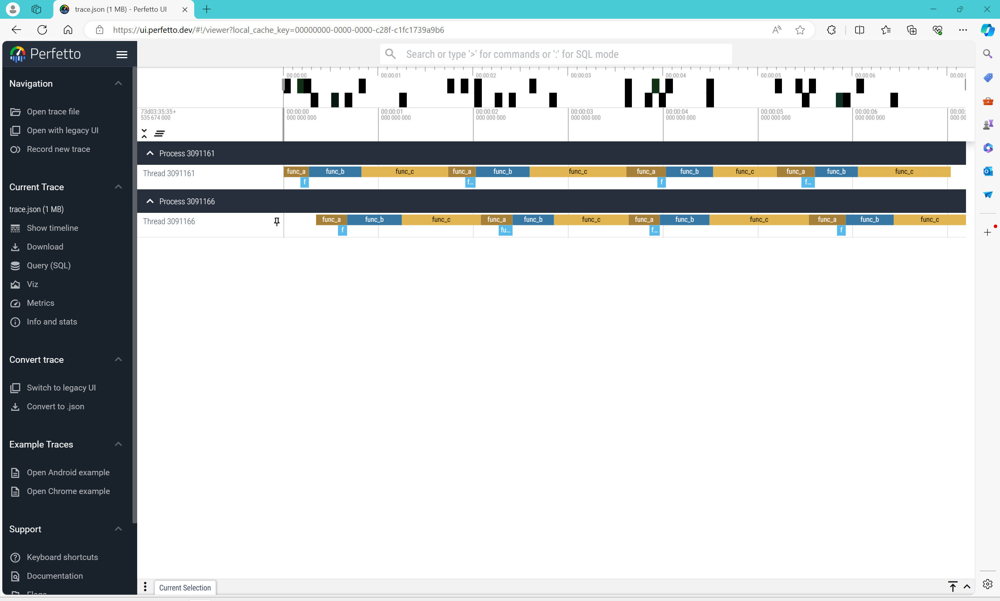

# Visualization

这个 **Demo** 演示了以下功能：

1. 使用 **eBPF** 批量追踪分析用户库函数的运行状态。
2. 可视化用户库函数的运行状态。

## Code

首先是 `func.c` 文件，里面有个多个函数，稍后我们将其编译成一个 `libfunc.so` 动态库。

```C
#include "func.h"

void func_a(){
    for (int i = 10 * 10000000; i--;);
    func_d();
    return;
}

void func_b(){
    for (int i = 20 * 10000000; i--;);
    return;
}

void func_c(){
    for (int i = 35 * 10000000; i--;);
    return;
}

void func_d(){
    for (int i = 5 * 10000000; i--;);
    return;
}
```

然后是 `main.c` 文件，稍后在编译时将此程序与 `libfunc.so` 库动态链接。

```C
#include <stdio.h>
#include "func.h"

int main() {
    printf("main start.\n");
    for (int j = 1 * 4; j--;){
        func_a();
        func_b();
        func_c();
    }
    printf("main end.\n");
    return 0;
}
```

## Trace

考虑到需要追踪的用户库函数过多，在此我们不再写单一的 `bpf.c` 文件，我们采用脚本生成的方式来批量探测用户库程序。

首先我们将需要探测的函数名写在 `funcs` 列表中，一共有 `["func_a", "func_b", "func_c", "func_d"]` 四个函数需要我们探测。

接着提前为每个被探测的函数写好一个模板 `template`，包含了 `start_[func_name]` 和 `end_[func_name]` 函数，分别探测用户库函数的开始和结束事件。

注意函数的输出内容分别为 `tid func_name start` 和 `tid func_name end`，这里的输出格式是为了后续的分析做铺垫。

我们使用循环构造的语句，不断从 `funcs` 中取出 `func_name`，并通过 `template.replace("[func_name]", func_name)` 构造对应的 bpf 程序，最后 `text` 就是我们动态生成的 bpf 程序。

生成 BPF 对象后，依旧通过动态遍历的形式来为 `"/usr/lib/libfunc.so"` 用户库里的函数搭载探测点。

至此，批量追踪用户库函数的功能实现完成。

```Python
from bcc import BPF

funcs = ["func_a", "func_b", "func_c", "func_d"]
template = """
int start_[func_name](struct pt_regs *ctx) {
    u64 tid = bpf_get_current_pid_tgid();
    bpf_trace_printk("%d [func_name] start\\n", tid);
    return 0;
}

int end_[func_name](struct pt_regs *ctx) {
    u64 tid = bpf_get_current_pid_tgid();
    bpf_trace_printk("%d [func_name] end\\n", tid);
    return 0;
}
"""
text = "".join([template.replace("[func_name]", func_name) for func_name in funcs])
b = BPF(text=text)

for func_name in funcs:
    b.attach_uprobe(name="/usr/lib/libfunc.so", sym=func_name, fn_name=f"start_{func_name}")
    b.attach_uretprobe(name="/usr/lib/libfunc.so", sym=func_name, fn_name=f"end_{func_name}")
```

## Analysis

接下来需要对追踪获得到的数据做分析，首先我们先创建一个全局变量 `func_start` 来维护每一个正在运行的函数的开始时间。

每次捕获到函数的运行状态时，通过 `tid, func_name, op = str(msg, encoding="utf-8").split(" ")` 取出对应的 `tid`、`func_name` 和 `op`。其中 `tid` 是线程 id、`func_name` 是当前执行的函数名、`op` 是 `"start"` 或 `"end"`。

考虑到多进程环境下，可能会有多个程序执行同个函数，所以我们不能单独用函数名来记录此函数的开始时间，我们还需要考虑线程 id，于是构造 `func_key = f"{tid}_{func_name}"` 来维护每个函数的开始时间。

每当有一个函数结束时，输出 `print(func_name, ts, dur, pid, tid)`。

```Python
func_start = {}

try:
    print("Tracing Func...")
    while True:
        try:
            (task, pid, cpu, flags, ts, msg) = b.trace_fields()
        except ValueError:
            continue
        tid, func_name, op = str(msg, encoding="utf-8").split(" ")
        func_key = f"{tid}_{func_name}"
        if op == "start":
            func_start[func_key] = ts
        elif op == "end":
            dur = ts - func_start[func_key]
            print(func_name, ts, dur, pid, tid)
except KeyboardInterrupt:
    exit()
```

## Virtualize

Chrome 提供了一个可视化的 trace viewer 工具，在 Chrome 浏览器中输入 [chrome://tracing/](chrome://tracing/) 即可打开此工具。

然后加载包含了 trace 数据的 `json` 文件，就可以查看波形了。`json` 文件的格式参考及解释如下：

```Json
[
    {
        "name": "func_d",
        "cat": "func",
        "ph": "X",
        "ts": 6320135710545.0,
        "pid": 3091161,
        "tid": 3091161,
        "dur": 91358.00041258335,
        "args": {}
    },
    {
        "name": 函数名,
        "cat": 标签,
        "ph": 常用 X,
        "ts": 开始时间(us),
        "pid": 进程号,
        "tid": 线程号,
        "dur": 持续时间(us),
        "args": 附带信息
    },
]
```

于是我们修改刚刚的分析函数，将其输出适配 Chrome 的可视化接口。

其实就是全局多维护了一个 `trace_data`，探测时用 `trace_data.append({})` 来添加信息，最后将 `trace_data` 转换成 `json` 文件。

```Python
import json

trace_data = []
func_start = {}

try:
    print("Tracing Func...")
    while True:
        try:
            (task, pid, cpu, flags, ts, msg) = b.trace_fields()
        except ValueError:
            continue
        tid, func_name, op = str(msg, encoding="utf-8").split(" ")
        func_key = f"{tid}_{func_name}"
        if op == "start":
            func_start[func_key] = ts
        elif op == "end":
            dur = ts - func_start[func_key]
            trace_data.append({
                "name": func_name,
                "cat": "func",
                "ph": "X",
                "ts": func_start[func_key] * 1_000_000,
                "pid": pid,
                "tid": int(tid),
                "dur": dur * 1_000_000,
                "args": {},
            })
except KeyboardInterrupt:
    print("\nEnd Tracing...")
    with open("trace.json", 'w', encoding='utf-8') as file:
        json.dump(trace_data, file, ensure_ascii=False, indent=4)
    exit()
```

